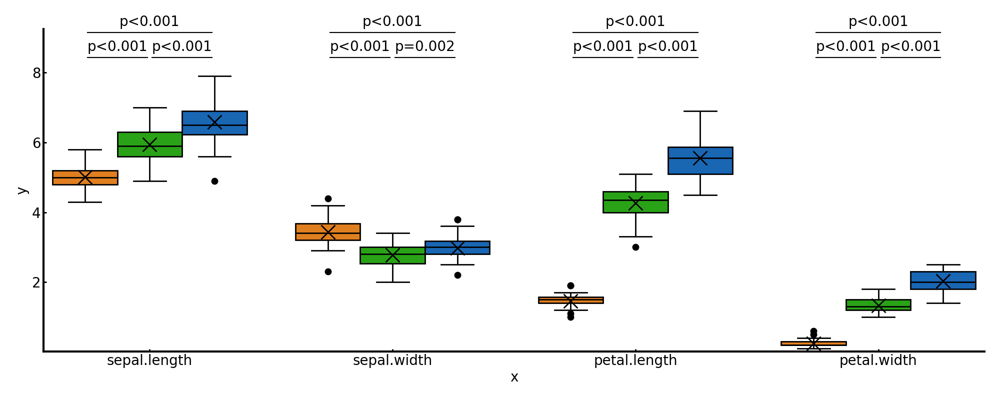
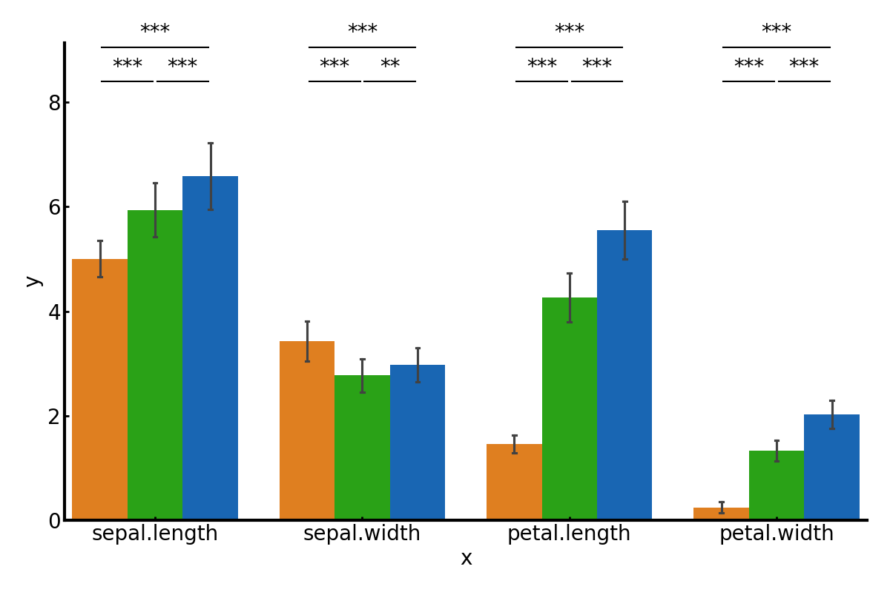

# 概要 Overview
直接論文やスライドに貼れるレベルの図を簡単に作成できるツール群  
A suite of tools that make it easy to create diagrams at a level that can be put directly on papers and slides.  


# APIs

## 基本的な使い方 Basic usage
``` Python
# インスタンス化 Instantiate
plot = PLOT(figsize=(10, 8), font_size=20, is_times_new_roman=False, save_mode=["png", "pdf"])
# is_times_new_roman : フォントをTimes New Romanにするか
# save_mode : saveするファイルの拡張子のリスト

# 必要に応じてデータフレームを変形 Transform data frames as required.
df = plot.convert(df, hue="target")
# 必要に応じてカラーパレットを取得 Get a colour palette if necessary.
color = plot.get_color("KW")

# 図の作成 Create figure.
plot.box(df, "test", hue="target", color=color)
```

irisデータセットを使用した時の例を`test.py`ファイルに示しています．  
An example when using the iris dataset is shown in the `test.py` file.  

## サポートされる図一覧 Supported figures

### 箱ひげ図 Box plot
``` Python
box(df, filename, figsize=None, kind="|", 
    x="x", y="y", hue=None, y_const=None, zero_start=False, 
    color=["#0066CC", "#FF0000"], yticks=None, rotation=0)
```
|            |          | 説明                                                                                                                                                                                                                                                                                                                                                      |
| ---------- | -------- | --------------------------------------------------------------------------------------------------------------------------------------------------------------------------------------------------------------------------------------------------------------------------------------------------------------------------------------------------------- |
| `df`       | Required | プロットするデータ<br>Data to be plotted                                                                                                                                                                                                                                                                                                                  |
| `filename` | Required | 保存するファイル名（例: `test`）<br>Filename for saving the plot (e.g., `test`)                                                                                                                                                                                                                                                                           |
| `kind`     | Option   | `" \| "` の時に縦向き，`"-"` の時に横向きの図を表示<br>Display vertical plot with `" \| "`, horizontal plot with `"-"`                                                                                                                                                                                                                                    |
| `x`        | Option   | x軸の要素<br>Elements for the x-axis                                                                                                                                                                                                                                                                                                                      |
| `y`        | Option   | y軸の要素<br>Elements for the y-axis                                                                                                                                                                                                                                                                                                                      |
| `hue`      | Option   | 群間を比較するときにその指標となるもの（`target={1,0}` の列がある場合、`target` を指定。例を参照）<br>Indicator for group comparison (e.g., `target` with values `{1,0}`)                                                                                                                                                                                 |
| `color`    | Option   | BOXの色。`hue=None` の時は1つの色コードを指定したリストを、`hue` が持つ変数の数分の色コードを指定したリストを渡す。デフォルトでは `hue=2` の場合に使用可能<br>Color of the box. If `hue=None`, provide a list of one color code. Otherwise, provide a list of color codes corresponding to the number of hue variables. By default, it works for `hue=2`. |
| `y_const`  | Option   | 基準となる横線を引くときに基準値の数値を指定<br>Specify a numeric value for drawing a reference horizontal line                                                                                                                                                                                                                                           |
| `yticks`   | Option   | y軸のメモリのリストを指定（例: `[0,1,2]`）<br>List of y-axis ticks (e.g., `[0,1,2]`)                                                                                                                                                                                                                                                                      |
| `rotation` | Option   | X軸のメモリラベルの角度<br>Rotation angle for x-axis tick labels |
|`stats`|Option  |`stat_name`は検定の名前`brunnermunzel`と`welch`をサポート<br>`stat_mark`は星の形状の定義．デフォルトは`*`であり，Noneを指定するとp値がそのまま表示される<br>`adjust_name`は多重比較の方法を定義，有名どころでは，`bonferroni`，`holm`，`fdr_bh`などが可能|


#### Exaple figures
~~~ Python
plot.box(df, "pic/box", hue="variety", color=color, stats={"stat_name": "welch", "stat_mark": None}, figsize=(20,8))
plot.box(df, "pic/box-", hue="variety", color=color, kind="-")
~~~



### 線グラフ Line plot
``` Python
line(df, filename, figsize=None, 
    x="x", y="y", hue=None, y_const=None, zero_start=False, 
    color=["#0066CC", "#FF0000"], xticks=None, yticks=None, rotation=0)
```
|            |          | 説明                                                                                                                                                                                                                                                                                                                                                      |
| ---------- | -------- | --------------------------------------------------------------------------------------------------------------------------------------------------------------------------------------------------------------------------------------------------------------------------------------------------------------------------------------------------------- |
| `df`       | Required | プロットするデータ<br>Data to be plotted                                                                                                                                                                                                                                                                                                                  |
| `filename` | Required | 保存するファイル名（例: `test`）<br>Filename for saving the plot (e.g., `test`)                                                                                                                                                                                                                                                                           |
| `x`        | Option   | x軸の要素<br>Elements for the x-axis                                                                                                                                                                                                                                                                                                                      |
| `y`        | Option   | y軸の要素<br>Elements for the y-axis                                                                                                                                                                                                                                                                                                                      |
| `hue`      | Option   | 群間を比較するときにその指標となるもの（`target={1,0}` の列がある場合、`target` を指定。例を参照）<br>Indicator for group comparison (e.g., `target` with values `{1,0}`)                                                                                                                                                                                 |
| `color`    | Option   | BOXの色。`hue=None` の時は1つの色コードを指定したリストを、`hue` が持つ変数の数分の色コードを指定したリストを渡す。デフォルトでは `hue=2` の場合に使用可能<br>Color of the box. If `hue=None`, provide a list of one color code. Otherwise, provide a list of color codes corresponding to the number of hue variables. By default, it works for `hue=2`. |
| `y_const`  | Option   | 基準となる横線を引くときに基準値の数値を指定<br>Specify a numeric value for drawing a reference horizontal line                                                                                                                                                                                                                                           |
| `xticks`   | Option   | x軸のメモリのリストを指定（例: `[0,1,2]`）<br>List of x-axis ticks (e.g., `[0,1,2]`)                                                                                                                                                                                                                                                                      |
| `yticks`   | Option   | y軸のメモリのリストを指定（例: `[0,1,2]`）<br>List of y-axis ticks (e.g., `[0,1,2]`)                                                                                                                                                                                                                                                                      |
| `rotation` | Option   | X軸のメモリラベルの角度<br>Rotation angle for x-axis tick labels                                                                                                                                                                                                                                                                                          |

### 棒グラフ Bar plot
``` Python
bar(df, filename, figsize=None, 
    x="x", y="y", hue=None, y_const=None, zero_start=False, 
    errorbar="sd", kind="|", stacked=False, 
    color=["#0066CC", "#FF0000"], xticks=None, yticks=None, rotation=0)
```
|            |          | 説明                                                                                                                                                                                                                                                                                                                                                      |
| ---------- | -------- | --------------------------------------------------------------------------------------------------------------------------------------------------------------------------------------------------------------------------------------------------------------------------------------------------------------------------------------------------------- |
| `df`       | Required | プロットするデータ<br>Data to be plotted                                                                                                                                                                                                                                                                                                                  |
| `filename` | Required | 保存するファイル名（例: `test`）<br>Filename for saving the plot (e.g., `test`)                                                                                                                                                                                                                                                                           |
| `kind`     | Option   | `" \| "` の時に縦向き，`"-"` の時に横向きの図を表示<br>Display vertical plot with `" \| "`, horizontal plot with `"-"`                                                                                                                                                                                                                                    |
| `errorbar` | Option   | エラーバーの表示方法を定義<br>Define how error bars are displayed                                                                                                                                                                                                                                                                                         |
| `x`        | Option   | x軸の要素<br>Elements for the x-axis                                                                                                                                                                                                                                                                                                                      |
| `y`        | Option   | y軸の要素<br>Elements for the y-axis                                                                                                                                                                                                                                                                                                                      |
| `hue`      | Option   | 群間を比較するときにその指標となるもの（`target={1,0}` の列がある場合、`target` を指定。例を参照）<br>Indicator for group comparison (e.g., `target` with values `{1,0}`)                                                                                                                                                                                 |
| `color`    | Option   | BOXの色。`hue=None` の時は1つの色コードを指定したリストを、`hue` が持つ変数の数分の色コードを指定したリストを渡す。デフォルトでは `hue=2` の場合に使用可能<br>Color of the box. If `hue=None`, provide a list of one color code. Otherwise, provide a list of color codes corresponding to the number of hue variables. By default, it works for `hue=2`. |
| `y_const`  | Option   | 基準となる横線を引くときに基準値の数値を指定<br>Specify a numeric value for drawing a reference horizontal line                                                                                                                                                                                                                                           |
| `xticks`   | Option   | x軸のメモリのリストを指定（例: `[0,1,2]`）<br>List of x-axis ticks (e.g., `[0,1,2]`)                                                                                                                                                                                                                                                                      |
| `yticks`   | Option   | y軸のメモリのリストを指定（例: `[0,1,2]`）<br>List of y-axis ticks (e.g., `[0,1,2]`)                                                                                                                                                                                                                                                                      |
| `rotation` | Option   | X軸のメモリラベルの角度<br>Rotation angle for x-axis tick labels  |
|`stats`|Option  |`stat_name`は検定の名前`brunnermunzel`と`welch`をサポート<br>`stat_mark`は星の形状の定義．デフォルトは`*`であり，Noneを指定するとp値がそのまま表示される<br>`adjust_name`は多重比較の方法を定義，有名どころでは，`bonferroni`，`holm`，`fdr_bh`などが可能|

#### Exaple figures
~~~ Python
plot.bar(df, "pic/bar", hue="variety", color=color)
~~~


### 混同行列  Confusion matrix
``` Python
confusion_matrix(ave, filename, figsize=None, 
                std=None, classes=None, cmap="Blues", fontsize=25)
```
|            |          | 説明                                                                            |
| ---------- | -------- | ------------------------------------------------------------------------------- |
| `ave`      | Required | SK-LEARNなどで求めた混同行列<br> Confusion matrix obtained by SK-LEARN, etc.    |
| `filename` | Required | 保存するファイル名（例: `test`）<br>Filename for saving the plot (e.g., `test`) |
| `std`      | Option   | 混同行列の標準偏差<br>Standard deviation of the confusion matrix                |
| `classes`  | Option   | クラスの名前<br>Class name                                                      |

#### Exaple figures


### スペクトログラム Spectrogram
``` Python
spectrogram(df, filename, figsize=None, 
            cmap="jet", xticks=None, yticks=None, rotation=0)
```

## 図以外のAPIs Util APIs
``` Python
convert(df, hue=None, index2x=False)
```


``` Python
get_color(name: Literal["BR", "BG", "KW", "C3", "C5"] = "BR")
```